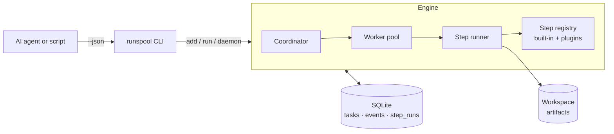

# Runspool

[](https://github.com/ethan-sun-dev/runspool/actions/workflows/ci.yml)
[](LICENSE)
[](https://www.python.org/)

**Local-first CLI workflows for reliable personal automation.**

Runspool turns scripts, files, and manual checklists into resumable, observable
workflows — with SQLite state, retries, logs, pause/resume controls, step
plugins, and JSON output for humans, scripts, and AI agents.

It runs entirely on your machine. No hosted service, no account, no data leaving
your laptop by default.

[简体中文 README](README.zh-CN.md) · [Docs](docs/) · [Examples](examples/)

---

## Why Runspool

Personal automation usually starts as a shell script and slowly turns into a
mess: when it dies halfway through, you don't know what ran; re-running redoes
work; there's no history; and pausing or retrying means editing the script.

Runspool gives that automation a backbone:

- **Resumable** — every task is a row in SQLite; a crash or reboot loses nothing.
- **Observable** — every state change is an event; every step run is timed.
- **Controllable** — pause, resume, retry, terminate, reprioritize from the CLI.
- **Composable** — workflows are ordered lists of steps; add your own as plugins.
- **Scriptable** — `--json` on every read command, built for shell and AI agents.

It is **not** an AI tool, and it is **not** a cloud workflow platform. It is a
small, dependable engine for turning local scripts, files, and checklists into
workflows you can trust.

## Install

Recommended for CLI use, with [uv](https://docs.astral.sh/uv/):

```bash
uv tool install runspool
```

If you don't have uv yet:

```bash
curl -LsSf https://astral.sh/uv/install.sh | sh
```

Then check the command:

```bash
runspool --help
```

Alternatively, install with pip:

```bash
pip install runspool
```

Or from source (for development):

```bash
git clone https://github.com/ethan-sun-dev/runspool
cd runspool
uv sync --extra dev
```

Requires Python 3.11+. Core dependencies: Typer, Pydantic, PyYAML (SQLite is in
the standard library).

## Quickstart (about 3 minutes, no setup)

```bash
# 1. Create a config and database.
runspool init

# 2. Queue a task. The default `local_file` workflow uses only built-in steps.
echo "Invoice #42  Total amount due: 1320  Payment terms: net 30" > invoice.txt
runspool add ./invoice.txt

# 3. Advance every task to completion, once.
runspool run

# 4. Look at the result.
runspool status
runspool inspect 1
```

You'll see the task flow through five steps and land its artifacts under
`workspace/ready/1/` (normalized Markdown, a summary, a classification, and
metadata). That's a complete workflow with persisted state, logs, and a step
timeline — and it ran with zero external dependencies.

## What it looks like



A **task** carries an `input` through a **workflow** — an ordered list of
**steps**. The **coordinator** claims queued tasks (respecting per-step
concurrency quotas), the **worker pool** runs each step, and the **state
machine** records every transition. Long jobs run under the `daemon`; one-shot
runs use `run`.

## Task lifecycle

```
queued → running → (next step) queued → … → completed
                 ↘ failed ──(retry)──↗
                 ↘ manual_required          (retries exhausted; needs you)
   running → pause_pending → paused → (resume) queued
   non-terminal → terminated   (completed / terminated refuse further control)
```

## CLI

```text
runspool init                     # create config + database
runspool add <input> -w <wf>      # queue a task (default workflow: local_file)
runspool run                      # advance all runnable tasks once (great for demos)
runspool daemon                   # run a resident loop (long-running automation)
runspool daemon-status            # report whether a daemon is running
runspool daemon-stop              # signal a running daemon to stop
runspool status [<id>]            # list tasks, or show one in detail
runspool inspect <id>             # agent-friendly snapshot + suggested next action
runspool logs <id>                # event history for a task
runspool overview                 # counts by status
runspool pause|resume|retry|terminate <id>
runspool set-priority|set-retries|set-step <id> <value>
runspool workflows                # list workflows and their steps
runspool doctor                   # check the local environment
```

Every read command supports `--json`:

```bash
runspool status --json
runspool inspect 1 --json
runspool logs 1 --json
runspool overview --json
runspool workflows --json
runspool doctor --json
```

See [docs/cli.md](docs/cli.md) for the full reference.

## Built for AI agents and scripts

`runspool inspect <id> --json` returns exactly what an automated caller needs to
decide what to do next — current state, the last error, the artifacts produced,
the actions that are valid right now, and a plain-language suggestion:

```json
{
  "id": 1,
  "status": "manual_required",
  "workflow": "client_intel",
  "current_step": "collect_sources",
  "last_error": "FileNotFoundError: Missing required source(s): requirements.md",
  "retry_count": 1,
  "max_retries": 0,
  "recent_events": [],
  "artifacts": [],
  "available_actions": ["retry", "set-step", "set-retries", "terminate"],
  "suggested_next_action": "FileNotFoundError: Missing required source(s): requirements.md. Resolve the cause, then run `runspool retry 1`."
}
```

An agent can poll `inspect --json`, act on `available_actions`, fix the cause,
and call `runspool retry 1` — no screen-scraping required. See
[docs/agent-json-output.md](docs/agent-json-output.md).

## Examples

Three runnable examples, each with its own README and sample data:

| Example | What it shows |
| --- | --- |
| [local-file-pipeline](examples/local-file-pipeline/) | The quickstart. Built-in steps only; runs offline in minutes. |
| [client-intel-brief](examples/client-intel-brief/) | A real consulting workflow: sources → briefing package. Custom plugin steps; demonstrates `manual_required` recovery. |
| [creator-publishing-pipeline](examples/creator-publishing-pipeline/) | A content pipeline that builds a multi-platform **draft** package (never auto-publishes). |

## Write a custom step

A step is a small class. It reads the task, does work, writes artifacts, and
returns a result:

```python
from runspool.engine.step import Step, StepContext, StepResult

class GreetStep(Step):
    name = "greet"

    def run(self, ctx: StepContext) -> StepResult:
        ctx.heartbeat("working")                 # optional progress
        name = ctx.task.get("name") or "world"
        return StepResult(message=f"hello, {name}")
```

Load it from config and use it in a workflow:

```yaml
plugin_paths: [steps]            # directories added to sys.path (relative to this config)
steps:
  greet:
    import: "my_steps:GreetStep"
workflows:
  hello:
    steps: [greet, archive]
```

Steps can also raise `StepDeferred` to wait for a precondition (retry next tick
without counting a failure), or raise any exception to fail and retry. See
[docs/writing-steps.md](docs/writing-steps.md).

## Concurrency

Runspool runs steps in a bounded thread pool. The `daemon` keeps the pool busy
across many ticks, so long steps don't block the queue, and a per-step
`concurrency` quota caps how many of a given step run at once. A crashed or
silent worker's task is reclaimed by heartbeat timeout. See
[docs/concepts.md](docs/concepts.md).

## Privacy & safety

- **Local-first.** All state lives under `workspace_root` on your machine. There
  is no hosted service and nothing is uploaded by default.
- **No secrets required.** The engine and built-in steps need no API keys.
- **Drafts, not auto-publish.** Content examples produce drafts and checklists;
  publishing is always a deliberate, manual step.

## Non-goals

- Not a hosted/cloud workflow platform.
- Not a distributed scheduler or a replacement for heavyweight orchestrators.
- Not an AI product (though it is deliberately AI-agent-friendly).
- No web UI in scope for now — the CLI and JSON are the interface.

## Roadmap

- Atomic multi-coordinator claiming (single-process is solid today).
- `runspool watch` to follow a task's events live.
- Optional structured log export (JSONL).
- A small library of community step plugins.
- Opt-in publish adapters for the creator example (draft submission only).

## Contributing

Contributions are welcome — see [CONTRIBUTING.md](CONTRIBUTING.md) and the
[Code of Conduct](CODE_OF_CONDUCT.md).

```bash
uv sync --extra dev
uv run ruff check .
uv run pytest
```

## License

[MIT](LICENSE).
